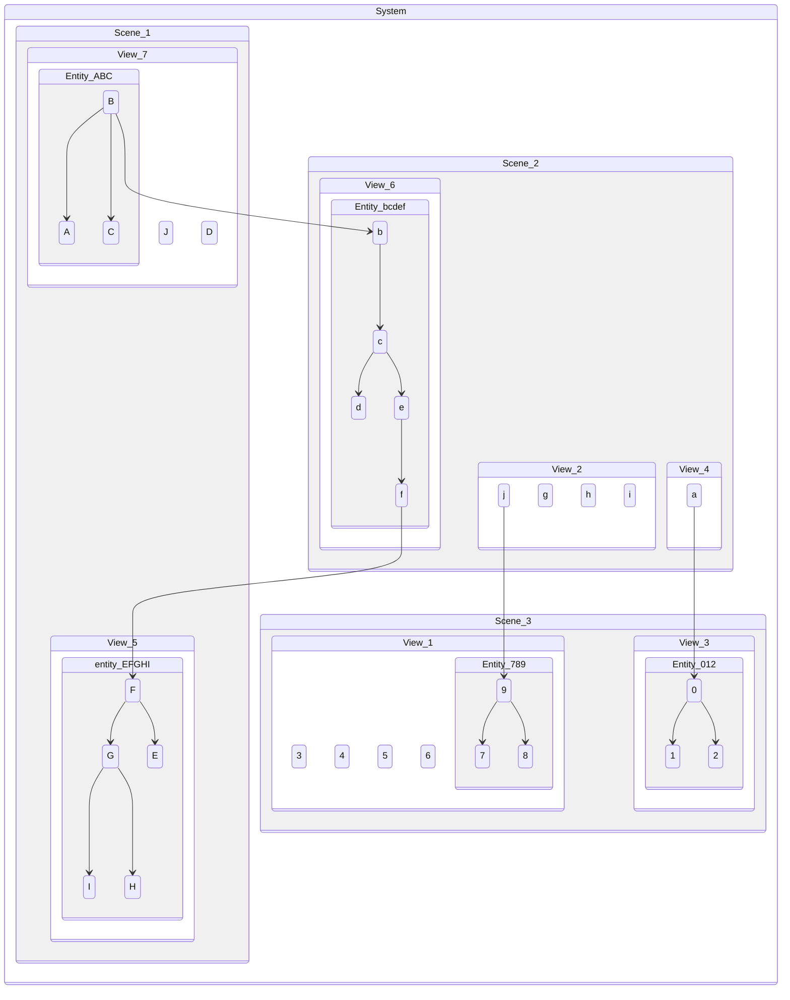

# Atmosphere Development Kit

Mixed and multi provider infrastructure as code automation and framework.

## Scene Providers

- [x] Local Filesystem
- [x] AWS CloudFormation
- [x] Azure Resource Manager
- [x] Google Cloud Deployment Manager
- [x] Alibaba Cloud Resource Orchestration Service
- [ ] HashiCorp Terraform (planned)
- [ ] Kubernetes (planned)
- [ ] Github (planned)

## Render Pipeline

To demonstrate the render pipeline, we will use the following Mermaid diagram.  
Assume `[A-Z]`, `[a-z]`, and `[0-9]` are all instances of the Component class.  
Components can be attached to Entities that can be attached to other Entities.  
Together they form a tree structure called a System.

The System can render into multiple Scenes. Each Scene can filter the Components
by their criteria. Once a Component is filtered by a Scene, it will no longer be
able to be filtered by any other Scene.

Once all Scenes are rendered, the System breaks each Scene down to independently
renderable Views. Theses Views are ordered and packaged in a Composition.

If you are a fellow game engine developer, you immediately may recognize this as
a multi headed renderer with an entity component system backing it.

If you are an Ops Engineer, the following terminology mapping might help you:

| Term        | Ops Lingo                    |
| ----------- | ---------------------------- |
| System      | Project/App/Chart etc.       |
| Scene       | Environment/Provider etc.    |
| View        | Stack/Manifest/Template etc. |
| Component   | Resource                     |
| Entity      | ResourceGroup                |
| Composition | Deployment                   |
| Token       | Deploy-Time Variable         |
