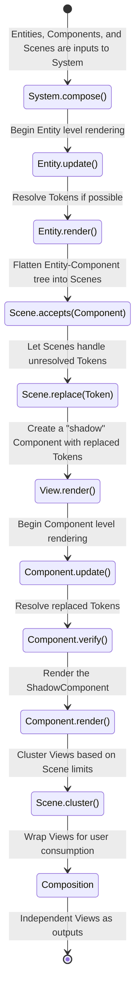

# ADK Object Model

The Object model in ADK is inspired by Unity3D's GameObject from an API consumer
perspective, however the Object model in ADK is much more sophisticated.

The Object model is designed as a Component-Entity System. Individual Components
are able to render to multiple Scenes simultaneously. Components can also cross
reference each other across Scenes.

This design is often times referred to as a "Multi-Headed Renderer".

## Terminology

### Token

Tokens are a special data type that can be used in place of a concrete value and
with a resolver that can be used to fetch the value later, asynchronously.

Tokens can have an optional name and an optional `userData` object carrying with
them around. The Object model uses Tokens to build dependency between Components
and Scenes they are rendered into.

### Component

Components are single rendering units. Components are the lowest moving parts in
the entire Object model. Components are always attached to an Entity.  
No Assumptions are ever made about Components except they subclass the abstract
class `Component` and implement the `render()` and `verify()` method.

Components render into an opaque object with type `any`.

### Entity

Entities are logical groupings of Components for end user application.  
Entities orchestrate their child Components to render into multiple Scenes.

### Scene

Scenes are what Entities render (flatten) their Components into. Scenes are made
of Views. Scenes may be of three types:

- `Scene.Type.Nondirectional`: Components in this scene can't reference other
  Components in other Scenes.
- `Scene.Type.Unidirectional`: Components in this scene can only reference
  Components in other Scenes, but other Scenes can't reference them.
- `Scene.Type.Bidirectional`: Components in this scene can reference other
  Components in other Scenes, and other Scenes can reference them as well.

### View

Views are the lowest level of rendering unit in the Object model. Views are what
Components in each scene eventually render into.

### Composition

Compositions are the final output of the Object model. Compositions are ordered
collection of independent Views that can be consumed by the end user.

### System

The System is the entry point to the Object model. The System is responsible for
orchestrating the entire rendering process.

## Render Loop

